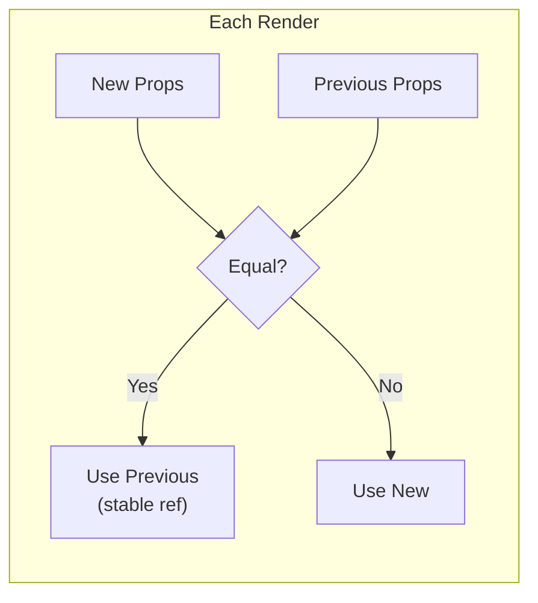

# stable()

HOC for automatic prop stabilization. Prevents unnecessary re-renders in memoized children by maintaining referential stability of function and Date props.

## Signature

```ts
function stable<TProps extends object, TRef = unknown>(
  Component: ComponentType<TProps> | ForwardRefRenderFunction<TRef, TProps>,
  customEquality?: PropEqualityConfig<TProps>
): ForwardRefExoticComponent<TProps & RefAttributes<TRef>>
```

## Parameters

### Component

The component to wrap.

- **Type:** `ComponentType<TProps> | ForwardRefRenderFunction<TRef, TProps>`
- **Required:** Yes

Accepts:
- Function components
- `forwardRef` components
- Render functions with `(props, ref)` signature

### customEquality

Per-prop equality configuration.

- **Type:** `PropEqualityConfig<TProps>`
- **Required:** No

```ts
type PropEqualityConfig<TProps> = {
  [K in keyof TProps]?: Equality<TProps[K]>;
};

type Equality<T> = 
  | "strict"    // Object.is (default)
  | "shallow"   // Shallow comparison
  | "shallow2"  // 2-level shallow
  | "shallow3"  // 3-level shallow
  | "deep"      // Deep equality (lodash isEqual)
  | ((a: T, b: T) => boolean);  // Custom function
```

---

## How It Works

For each prop on every render:

1. Compare the new value with the previous value
2. If equal (according to configured equality), **keep the previous reference**
3. If not equal, use the new value

This maintains referential stability for memoized children.



### Auto-Stabilization

Without custom equality, `stable()` automatically handles:

| Type | Stabilization Method | Behavior |
|------|---------------------|----------|
| **Functions** | Stable wrapper pattern | Reference stays same, always calls latest |
| **Dates** | `getTime()` comparison | Keep previous if same timestamp |
| **Primitives** | `Object.is` | Keep previous if strictly equal |
| **Objects/Arrays** | `Object.is` (reference) | Use custom equality for value comparison |

::: tip Function stabilization pattern
Functions use the same pattern as [`useStore()`](/api/use-store): a stable wrapper is created that always calls the **latest** function from props. The wrapper reference never changes, so memoized children don't re-render, but the actual function behavior always uses the current prop.

```tsx
// Reference stays stable across all renders
<Stable onClick={() => doSomething(value1)} />
<Stable onClick={() => doSomething(value2)} />  // Same reference, but calls value2 version!
```
:::

---

## Examples

### Basic Usage

```tsx
import { stable } from "storion/react";

// Wrap a component - functions and dates are auto-stabilized
const StableButton = stable(({ onClick, date }) => (
  <button onClick={onClick}>
    {date.toDateString()}
  </button>
));

// Now inline functions won't cause child re-renders
function Parent() {
  return (
    <StableButton 
      onClick={() => console.log("clicked")}  // Stabilized!
      date={new Date()}                        // Stabilized!
    />
  );
}
```

### With Memoized Children

The primary use case: prevent cascade re-renders in memoized children.

```tsx
import { memo } from "react";
import { stable } from "storion/react";

// Expensive child component
const ExpensiveList = memo(({ items, onItemClick }) => {
  console.log("ExpensiveList rendered");  // Only when items/onItemClick actually change
  return (
    <ul>
      {items.map(item => (
        <li key={item.id} onClick={() => onItemClick(item)}>
          {item.name}
        </li>
      ))}
    </ul>
  );
});

// Parent with stabilized props
const Parent = stable(({ items, onItemClick }) => (
  <ExpensiveList items={items} onItemClick={onItemClick} />
));

// Usage - even with inline function, ExpensiveList won't re-render unnecessarily
function App() {
  const [items] = useState([{ id: 1, name: "Item 1" }]);
  const [, forceRender] = useState(0);
  
  return (
    <>
      <button onClick={() => forceRender(n => n + 1)}>Force Render</button>
      <Parent 
        items={items}
        onItemClick={(item) => console.log(item)}  // Stabilized!
      />
    </>
  );
}
```

### Custom Equality

Specify equality strategies for specific props:

```tsx
const StableList = stable(
  ({ items, config, onSelect }) => (
    <ul>
      {items.map(item => (
        <li key={item.id} onClick={() => onSelect(item)}>
          {item.name}
        </li>
      ))}
    </ul>
  ),
  {
    // Shallow compare array items
    items: "shallow",
    
    // Deep compare nested config object
    config: "deep",
    
    // Custom: compare only by specific property
    onSelect: (a, b) => a.toString() === b.toString(),
  }
);
```

### With forwardRef

Works seamlessly with ref forwarding:

```tsx
import { forwardRef, useRef } from "react";
import { stable } from "storion/react";

// Original forwardRef component
const Input = forwardRef<HTMLInputElement, { onFocus: () => void }>(
  ({ onFocus }, ref) => (
    <input ref={ref} onFocus={onFocus} placeholder="Focus me" />
  )
);

// Wrap with stable
const StableInput = stable(Input);

// Usage - ref is properly forwarded
function Form() {
  const inputRef = useRef<HTMLInputElement>(null);
  
  return (
    <>
      <StableInput 
        ref={inputRef}
        onFocus={() => console.log("focused")}  // Stabilized!
      />
      <button onClick={() => inputRef.current?.focus()}>
        Focus Input
      </button>
    </>
  );
}
```

### Render Function with Ref

Also works with render functions that accept ref as second argument:

```tsx
const StableInput = stable(
  ({ value, onChange }, ref: React.Ref<HTMLInputElement>) => (
    <input ref={ref} value={value} onChange={onChange} />
  )
);
```

---

## When to Use

| Scenario | Use `stable()` |
|----------|----------------|
| Parent passes inline callbacks to memoized children | ✅ Yes |
| Parent creates new Date objects each render | ✅ Yes |
| Parent passes objects/arrays that need value comparison | ✅ Yes (with custom equality) |
| Simple component without memoized children | ❌ Unnecessary |
| Callbacks depend on closure values that change | ⚠️ Use `useCallback` instead |

### stable() vs useCallback/useMemo

| Approach | When to Use |
|----------|-------------|
| `stable()` | Stabilize multiple props at once; always use latest function |
| `useCallback` | Need to intentionally re-render children when dependencies change |
| `useMemo` | Compute derived values with explicit dependency tracking |

```tsx
// ✅ stable() - simpler, always calls latest
const StableParent = stable(({ onClick, items }) => (
  <MemoChild onClick={onClick} items={items} />
));

// useCallback - explicit control over when reference changes
function Parent({ onClick, items }) {
  // Reference changes when deps change, triggering child re-render
  const stableOnClick = useCallback(onClick, [onClick]);
  return <MemoChild onClick={stableOnClick} />;
}
```

::: info Key difference
`stable()` wrapper functions always call the latest prop function. `useCallback` creates new references when dependencies change, which can trigger child re-renders. Choose based on whether you want children to re-render when callback behavior changes.
:::

---

## Return Value

Returns a `ForwardRefExoticComponent` that:

- Accepts the same props as the wrapped component
- Supports ref forwarding (always wrapped with `forwardRef`)
- Has `displayName` set to `Stable(OriginalName)` for DevTools

```ts
const StableButton = stable(Button);
StableButton.displayName; // "Stable(Button)"
```

---

## Best Practices

### DO: Use with memoized children

```tsx
// ✅ stable() shines when children are memoized
const Parent = stable(({ onClick }) => (
  <MemoizedChild onClick={onClick} />
));
```

### DO: Combine multiple unstable props

```tsx
// ✅ Stabilize multiple props at once
const Parent = stable(({ onClick, onHover, date, config }) => (
  <Child onClick={onClick} onHover={onHover} date={date} config={config} />
));
```

### DON'T: Wrap without memoized children

```tsx
// ❌ Unnecessary - children will re-render anyway
const Parent = stable(({ onClick }) => (
  <NonMemoizedChild onClick={onClick} />  // Child re-renders regardless
));
```

### DO: Trust that latest function is always called

```tsx
// ✅ Works correctly - stable wrapper always calls latest function
const Parent = stable(({ count }) => (
  <MemoChild onClick={() => console.log(count)} />
));

// When count changes:
// - MemoChild does NOT re-render (stable reference)
// - But clicking calls the NEW function with current count
```

---

## Related

- [`useStore()`](/api/use-store) — Subscribe to store state
- [`withStore()`](/api/with-store) — Separate hooks from render
- [`memo()`](https://react.dev/reference/react/memo) — React's memoization HOC

