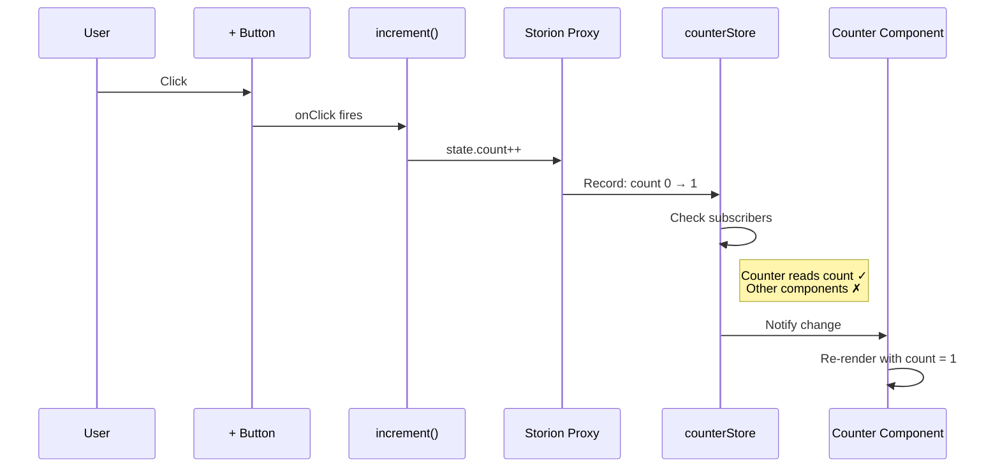

# Getting Started

This guide walks you through setting up Storion and building your first reactive store. By the end, you'll understand the core pattern that makes Storion different from other state management libraries.

## What's This For?

You're here because you need to manage state in a React app. Maybe you've tried Redux (too much boilerplate), Zustand (manual selectors), or Context (re-renders everything). Storion gives you:

- **Automatic tracking** — read state naturally, updates happen automatically
- **Direct mutation** — write `state.count++` instead of dispatching actions
- **Type inference** — TypeScript just works, no manual typing

## The Core Idea

**In 30 seconds:** Most state libraries require you to manually specify which state your component depends on. Storion flips this:

```
Traditional: "Tell me what you want, I'll check if it changed"
             → You must be precise, or face stale data / extra re-renders

Storion:     "Just use state naturally, I'll watch what you touch"
             → Write natural code, get optimal updates
```

When you access `state.count` in your component, Storion records: "this component depends on `count`". When `count` changes, only components that read `count` are notified. You never specify dependencies manually.

## Installation

::: code-group

```bash [npm]
npm install storion
```

```bash [pnpm]
pnpm add storion
```

```bash [yarn]
yarn add storion
```

:::

::: info Requirements
- React 18+ (for useSyncExternalStore)
- TypeScript 4.7+ (optional but recommended)
:::

## Your First Store

Let's build a counter step by step. We'll explain every line.

### Step 1: Define the Store

Create a new file for your store:

```ts
// stores/counterStore.ts
import { store } from 'storion/react';

// store() creates a store specification.
// It doesn't create the actual instance yet - that happens when you use it.
export const counterStore = store({
  // name: Used in devtools and error messages to identify this store.
  // Pick something descriptive that you'll recognize when debugging.
  name: 'counter',

  // state: Your initial data. This becomes reactive automatically.
  // Storion wraps it in a Proxy that tracks when properties are read or written.
  state: {
    count: 0,
  },

  // setup: A function that runs ONCE when the store is first created.
  // It receives a context object with helpers, and returns the actions.
  setup({ state }) {
    // The `state` parameter is a reactive proxy of your initial state.
    // Reading from it tracks dependencies. Writing to it triggers updates.

    // Return an object containing all the actions this store exposes.
    // Actions are just regular functions - they're not "dispatched".
    return {
      // increment: When called, directly mutates the state.
      // This triggers any component that's reading `count` to re-render.
      increment: () => {
        state.count++;  // Direct mutation - no dispatch, no action type!
      },

      decrement: () => {
        state.count--;
      },

      reset: () => {
        state.count = 0;
      },
    };
  },
});
```

### What's Happening Here?

1. **`store()`** creates a *specification* (a recipe), not an instance
2. **`name`** is for debugging — you'll see it in errors and devtools
3. **`state`** is your initial data — it becomes reactive via Proxy
4. **`setup()`** runs once when the store is created — it returns actions
5. **Actions mutate state directly** — no reducers, no dispatch

::: tip Why `store()` returns a spec, not an instance?
This enables dependency injection and testing. The actual instance is created by a container when your app starts. This separation lets you mock stores in tests or isolate state in SSR.
:::

### Step 2: Create a Container

The container manages all your store instances. Think of it as the "brain" of your state management:

```tsx
// App.tsx
import { container, StoreProvider } from 'storion/react';

// container() creates the central hub for all stores.
// It handles: instance creation, caching, dependency injection, cleanup.
const app = container();

function App() {
  return (
    // StoreProvider makes the container available to all child components.
    // Any component can now access stores via useStore().
    <StoreProvider container={app}>
      <Counter />
    </StoreProvider>
  );
}
```

### What's Happening Here?

1. **`container()`** creates an instance manager — it creates stores on-demand
2. **`StoreProvider`** uses React Context to pass the container down the tree
3. **Components don't import containers** — they use `useStore()` which finds it automatically

::: details Why use a container?
Without a container:
- Where do stores live? (Global variables? Module singletons?)
- How do stores find each other? (Import cycles?)
- How do you reset for testing? (Manual cleanup?)
- How do you isolate SSR requests? (Shared state = data leaks!)

The container solves all of these by being the single source of truth for store instances.
:::

### Step 3: Use the Store in a Component

Now connect your component to the store:

```tsx
// components/Counter.tsx
import { useStore } from 'storion/react';
import { counterStore } from '../stores/counterStore';

function Counter() {
  // useStore() connects your component to Storion.
  // The selector function tells Storion what data your component needs.
  const { count, increment, decrement } = useStore(({ get }) => {
    // get() retrieves a store from the container.
    // Returns a tuple: [state, actions]
    const [state, actions] = get(counterStore);

    // Return only what this component needs.
    // IMPORTANT: Everything you access here is tracked automatically!
    return {
      count: state.count,           // Accessing state.count → tracked dependency
      increment: actions.increment, // Actions are stable references
      decrement: actions.decrement,
    };
  });

  // This component ONLY re-renders when `count` changes.
  // If we had other state (like `name`), changing it wouldn't affect this.
  return (
    <div>
      <button onClick={decrement}>-</button>
      <span>{count}</span>
      <button onClick={increment}>+</button>
    </div>
  );
}
```

### What's Happening Here?

1. **`useStore(selector)`** — the selector runs during render
2. **`get(counterStore)`** — retrieves (or creates) the store instance from the container
3. **`[state, actions]`** — tuple destructuring gives you reactive state and stable actions
4. **Accessing `state.count`** — this is where the magic happens! Storion records: "Counter component depends on count"
5. **When `increment` mutates `state.count`** — Storion notifies only components that read `count`

::: warning The selector is special
The selector function is tracked. Any state you read inside it becomes a dependency. This is different from Redux where you manually specify what to watch.
:::

## Understanding the Flow

Let's trace what happens when a user clicks the increment button:



## The Shorthand: `create()`

For simple apps or isolated features, skip the container setup entirely:

```tsx
import { create } from 'storion/react';

// create() is a shorthand that creates both the store and a custom hook.
// Perfect for single-store apps, isolated components, or quick prototypes.
const [counter, useCounter] = create({
  name: 'counter',
  state: { count: 0 },
  setup({ state }) {
    return {
      increment: () => { state.count++; },
      decrement: () => { state.count--; },
    };
  },
});

function Counter() {
  // Simpler selector: receives (state, actions, ctx) directly
  // No need to call get() - it's done for you
  // ctx provides: mixin, scoped, once, id, container (same as useStore)
  const { count, increment } = useCounter((state, actions, ctx) => ({
    count: state.count,
    increment: actions.increment,
  }));

  return <button onClick={increment}>{count}</button>;
}

// ✨ No StoreProvider needed!
// The store instance is created automatically and shared globally.
```

### When to Use Which?

| Approach | Best For |
|----------|----------|
| `create()` | Single feature, isolated component, quick prototypes |
| `store()` + container | Multiple stores, cross-store dependencies, testing, DI |

::: tip Start with `create()`
If you're just starting or building a small feature, use `create()`. You can always migrate to the full container setup later without changing your store definitions.
:::

## Common Mistakes

### ❌ Mistake 1: Nested Mutation

```ts
setup({ state }) {
  return {
    // ❌ WRONG - nested mutation won't trigger reactivity
    updateName: (name: string) => {
      state.user.name = name;  // This doesn't work!
    },
  };
}
```

**Why?** Storion tracks first-level property access. Nested mutations bypass the tracking system.

**Fix:** Use `update()` for nested changes:

```ts
setup({ state, update }) {
  return {
    // ✅ CORRECT - use update() for nested changes
    updateName: (name: string) => {
      update(draft => {
        draft.user.name = name;
      });
    },
  };
}
```

### ❌ Mistake 2: Calling `get()` Inside Actions

```ts
setup({ get }) {
  return {
    // ❌ WRONG - get() can only be called during setup
    doSomething: () => {
      const [other] = get(otherStore);  // This throws!
    },
  };
}
```

**Why?** `get()` is a setup-time function for dependency declaration.

**Fix:** Capture the store reference during setup:

```ts
setup({ get }) {
  // ✅ CORRECT - capture during setup
  const [otherState, otherActions] = get(otherStore);

  return {
    doSomething: () => {
      // Use the captured reference - it's always current
      console.log(otherState.value);
    },
  };
}
```

### ❌ Mistake 3: Anonymous Functions in `trigger()`

```tsx
// ❌ WRONG - anonymous functions create new references each render
trigger(() => actions.fetch(userId), [userId]);
```

**Why?** `trigger()` uses the function reference as a cache key. Anonymous functions are new every render.

**Fix:** Pass the action directly:

```tsx
// ✅ CORRECT - stable function reference
trigger(actions.fetch, [userId], userId);
```

### ❌ Mistake 4: Async Effects

```ts
// ❌ WRONG - effects must be synchronous
effect(async (ctx) => {
  const data = await fetchData();  // Can't await in effect!
  state.data = data;
});
```

**Why?** Effects need to complete synchronously to track dependencies properly.

**Fix:** Use `ctx.safe()` for async operations:

```ts
// ✅ CORRECT - use ctx.safe() for async
effect((ctx) => {
  ctx.safe(fetchData()).then(data => {
    state.data = data;
  });
});
```

## What's Next?

You now understand the core pattern! Here's where to go next:

### Building on the Basics

- **[Core Concepts](/guide/core-concepts)** — Understand stores, containers, services, and reactivity in depth
- **[Stores](/guide/stores)** — Learn about `update()`, `focus()`, and lifecycle

### Adding Features

- **[Effects](/guide/effects)** — Reactive side effects with cleanup
- **[Async State](/guide/async)** — Data fetching with loading/error states
- **[Dependency Injection](/guide/dependency-injection)** — Services, mocking, testing

### Going Deeper

- **[Reactivity](/guide/reactivity)** — How auto-tracking works under the hood
- **[Middleware](/guide/middleware)** — Logging, persistence, devtools
- **[API Reference](/api/store)** — Complete function documentation

::: tip Progressive Complexity
Storion is designed to be **simple at first, powerful as you grow**. Start with basic stores and direct mutations. As your app grows, layer in async state, effects, dependency injection, and middleware — all without rewriting existing code.
:::
